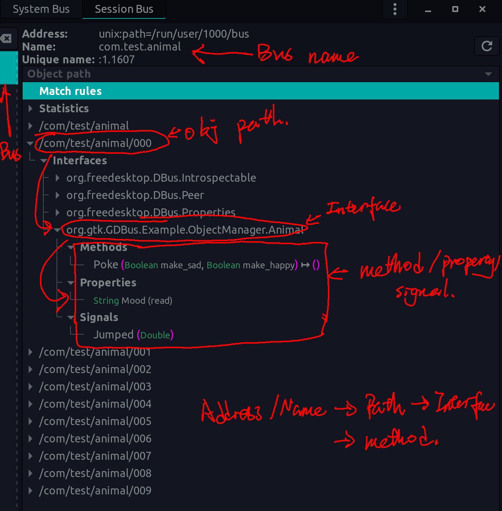

# Dbus Server

Read introduction to dbus [here](https://dbus.freedesktop.org/doc/dbus-tutorial.html).



Reference can be found in [high level d-bus support](https://developer.gnome.org/gio/stable/gdbus-convenience.html)

## Step 1: Generate Code

Follow [Generating code and docs](https://www.freedesktop.org/software/gstreamer-sdk/data/docs/latest/gio/ch30s05.html#gdbus-example-codegen-server) to define dbus interface and generate the interface code which has:

- dbus object initializer `xxx_object_skeleton_new`
- interface initializer `xxx_skeleton_new()`
- function to emit signals
- method handling function protopyte. `g_signal_connect(animal, "handle-poke", G_CALLBACK(on_animal_poke), NULL);` For example the interface has method poke, we can use "handle-poke" to connect the handling callback which is defined by its protopyte. 
- proxy related functions..etc

Command to generate the example code.

```bash
gdbus-codegen --interface-prefix org.gtk.GDBus.Example.ObjectManager. \
              --generate-c-code generated-code                        \
              --c-namespace Example                                   \
              --c-generate-object-manager                             \
              --generate-docbook generated-docs                       \
              example.xml
```

## Step 2: Code it following:

- apply name from dbus session bus using function `g_bus_own_name`.
- in the callback `GBusAcquiredCallback`， export the interface.
  - Create a `GDBusObjectManagerServer`， with path similar to the server name. For example, if a D-Bus service is available at the well-known name net.example.ExampleService1, the object manager should typically be exported at /net/example/ExampleService1.
  - Create a dbus object by calling `xxx_object_skeleton_new(object path)`.
  - Create the interface for the object by calling `xxx_skeleton_new()`.
  - Set the default properities on the interface and register method calls.
  - Bind the interface to the object by `xxx_object_skeleton_set_xxx`.
  - Export the object to object manager by `g_dbus_object_manager_server_export(server, object)`, after this, the object can be freed by `g_object_unref`.
  - Export the object manager by `g_dbus_object_manager_server_set_connection(manager, connection)`

## Other
GDBusObjectManagerServer is used to export GDBusObject instances using the standardized org.freedesktop.DBus.ObjectManager interface. 

GDBusObjectManagerClient for the client-side code that is intended to be used with GDBusObjectManagerServer or any D-Bus object implementing the org.freedesktop.DBus.ObjectManager interface.