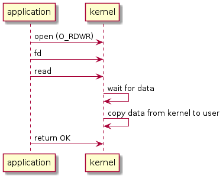
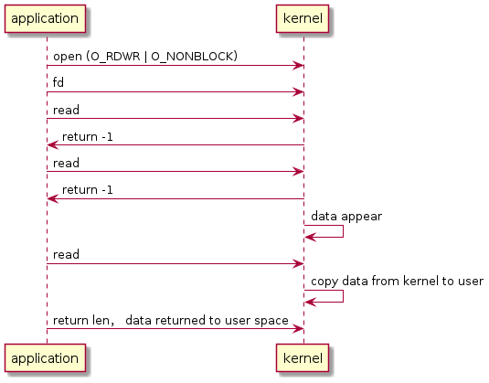

# NON/Blocking IO to read input

Build:

`arm-buildroot-linux-gnueabihf-gcc main.c -o app`

Execute:

`./app /path/to/input device [nonblocking]`, example is `./app /dev/input/event0`

## Blocking read

## Non-blocking read

