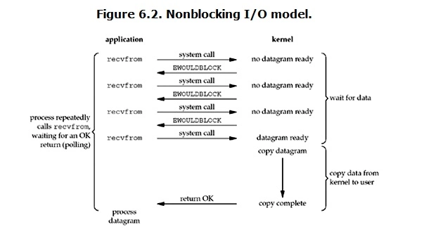
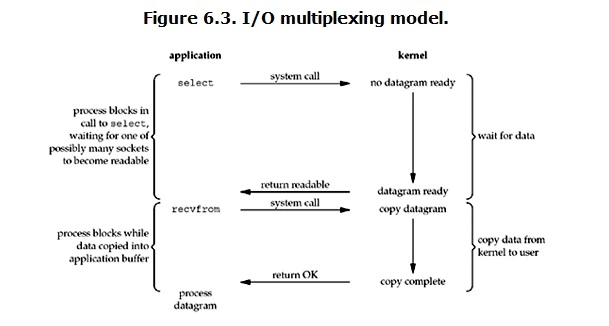
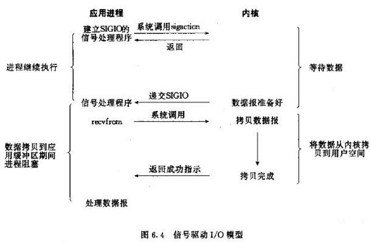
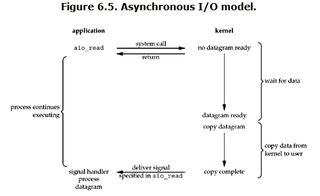

# INPUT System Linux

## IO models

## Blocking/Non-Blocking IO model




Example:

[Example code read from input - non/blocking.](./01_blocking_io/README.md)

## IO Multipluxing model

IO multipluxing model allows user to watch multiple descriptors, once any of them are readable/writable, the application is able to read/write. The operation is sync blocking IO since the application is in charge of read/write which is blocking.




## Signal Driven IO model



```
#include <signal.h>

int sigaction(int signum, const struct sigaction *act,
             struct sigaction *oldact); 
```

## Async IO model


