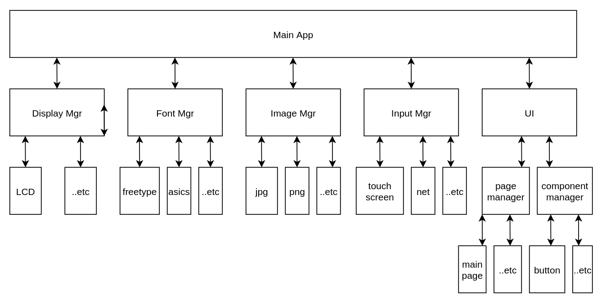

# Production Tool exercise

## Introduction

The application will:

- Load test components from config.conf and generate ui from configuration.
- For button that can be pressed, muanl test is required, tester need to press button when certain test is done.
- For button that cannot be pressed, automatic test is done, result will be received via udp package.
- Another button that will trigger certain process, like firmware update, it will call script and progress is updated on the button with percentage.

The application includes:

- framebuffer
- freetype font
- touch screen
- net

which are done almost without libraries to exercise linux programming.

## Architecture

A simple drawing is created to introduce the architecture.

## Used thrid party library

- tslib
- freetype
