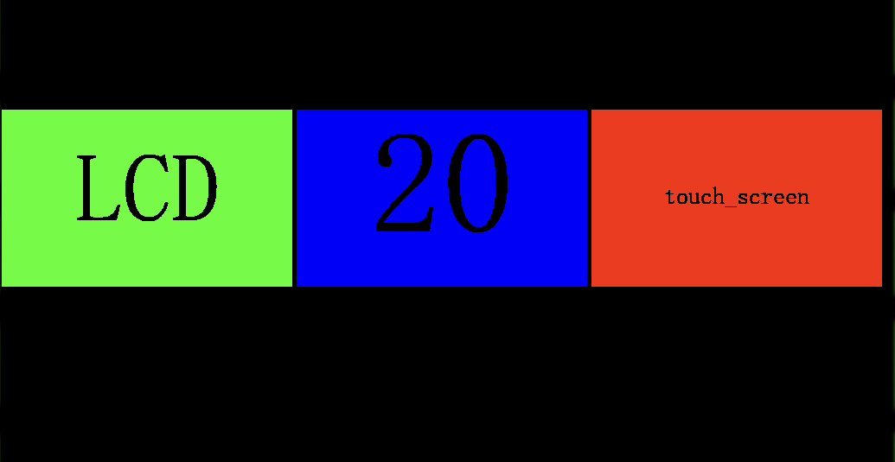

# Production Tool exercise

## Introduction

LCD Display:

The application will:

- Load test components from config.conf and generate ui from configuration.
- For button that can be pressed, muanl test is required, tester need to press button when certain test is done.
- For button that cannot be pressed, automatic test is done, result will be received via udp package.
- Another button that will trigger certain process, like firmware update, it will call script and progress is updated on the button with percentage.

The application includes:

- framebuffer
- freetype font
- touch screen
- net

which are done almost without libraries to exercise linux programming. The code quality is not guaranteed since no unit test is performed here but basic functional tests for each modules are done.

## Architecture

A simple drawing is created to introduce the architecture.

All the manager layers provide interface for the upper layer (Main app) and define framwork for the lower layer (functional modules which implements common features to support manager). In this case, the managers modules hold common logic for all child modules and child modules only need to implement it's specific feature.

For example, the input manager will define how the input event should look like and how it's reported, its children will implement their own feature. Input manager can have touch screen input, which only have logic related to touch screen. It can also have network input, which only have logic realted to network. 

To reduce dpendency, each time a child module is added, `MODULE_EXPORT(init_func);` should be used.

## Used thrid party library

- tslib
- freetype
